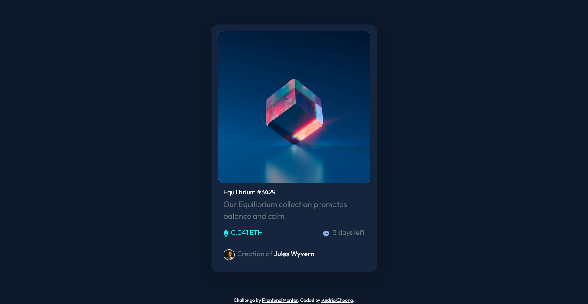

# Frontend Mentor - NFT preview card component solution

This is a solution to the [NFT preview card component challenge on Frontend Mentor](https://www.frontendmentor.io/challenges/nft-preview-card-component-SbdUL_w0U). Frontend Mentor challenges help you improve your coding skills by building realistic projects. 

## Table of contents

- [Overview](#overview)
  - [The challenge](#the-challenge)
  - [Screenshot](#screenshot)
  - [Links](#links)
  - [My process](#my-process)
  - [Built with](#built-with)
  - [What I learned](#what-i-learned)
  - [Continued development](#continued-development)
  - [Useful resources](#useful-resources)
- [Author](#author)
- [Acknowledgments](#acknowledgments)

## Overview

### The challenge

Users should be able to:

- View the optimal layout depending on their device's screen size
- See hover states for interactive elements

### Screenshot



### Links

- Solution URL: [Add solution URL here](https://github.com/audriecheong/nft-preview-component)
- Live Site URL: [Add live site URL here](https://nft-preview-component-five.vercel.app)

## My process

I started by writing down the HTML first to give this page a structure. Then Boostratp 4 was added shortly after. But most of the components was styled by using CSS.

### Built with

- Semantic HTML5 markup
- CSS custom properties
- Flexbox
- CSS Grid
- Bootstrap 4

### What I learned

Use this section to recap over some of your major learnings while working through this project. Writing these out and providing code samples of areas you want to highlight is a great way to reinforce your own knowledge.

To see how you can add code snippets, see below:

```html
<div class="col-6 price">
  <span class="eth">&nbsp; 0.041 ETH</span>
</div>
```
```css
.card-image {
  background-color: hsl(178, 100%, 50%);
  background-image: url(images/icon-view.svg);
  background-size: 50px;
  background-repeat: no-repeat;
  background-position: center;
  border-radius: 10px;
}

.card-img-top:hover {
  height: 100%;
  width: 100%;
  opacity: 60%;
  transition: .5s ease;
}
```

### Continued development

I found it hard to change the color of the icon while it's on a hover state.

### Useful resources

- [w3school](https://www.w3schools.com/howto/howto_css_image_overlay.asp) - This is an amazing article which helped me finally understand XYZ. I'd recommend it to anyone still learning this concept.

## Author

- Website - [Audrie Cheong](https://www.audriecheong.site)
- Frontend Mentor - [@audriecheong](https://www.frontendmentor.io/profile/audriecheong)
- Instagram - [@audriecheong](https://www.instagram.com/audriecheong)

## Acknowledgments
 